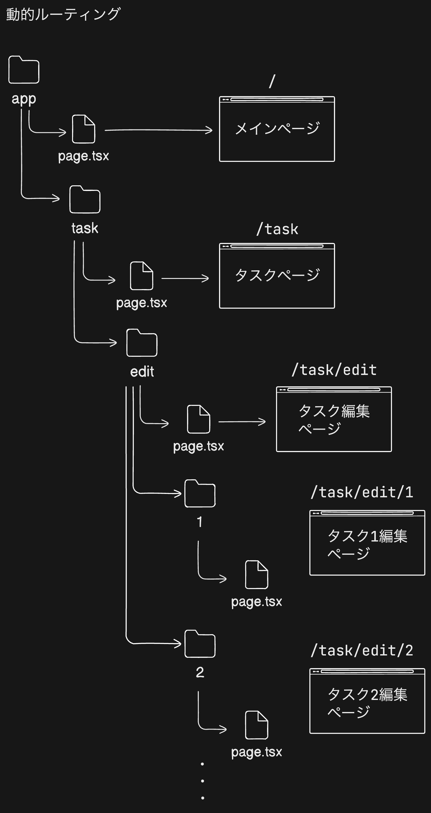
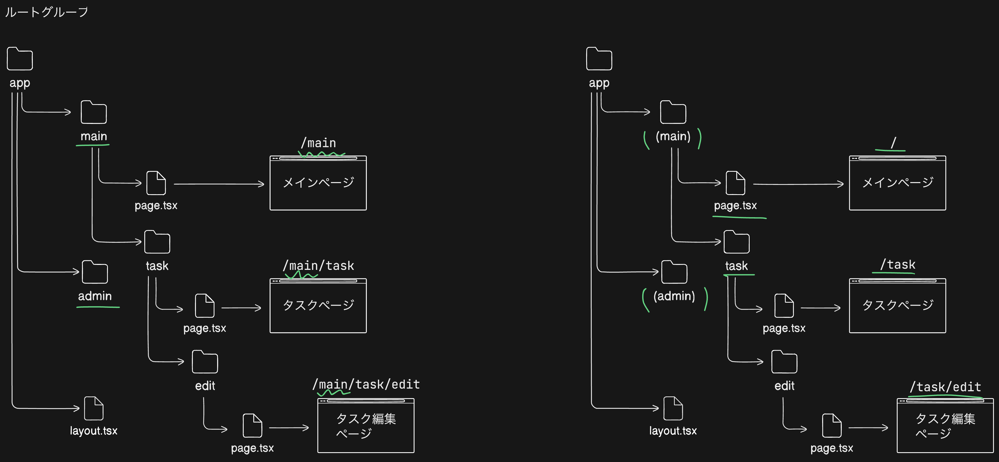
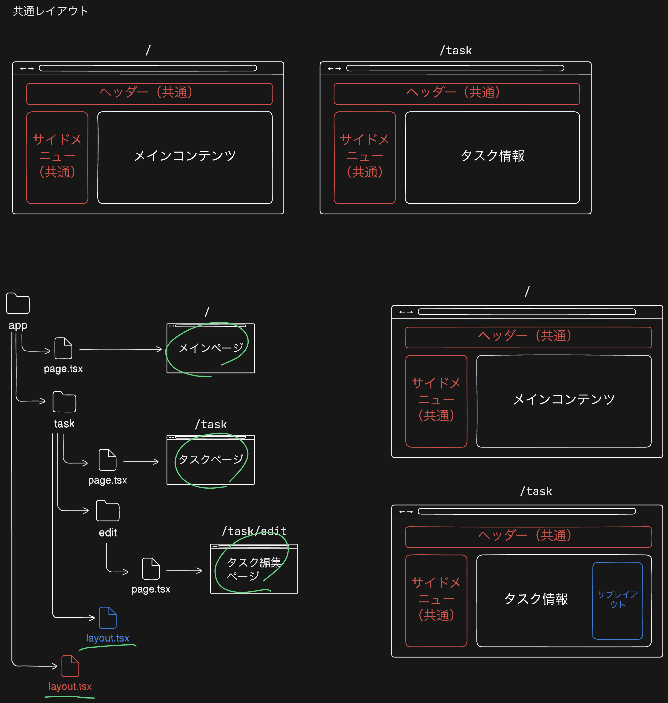
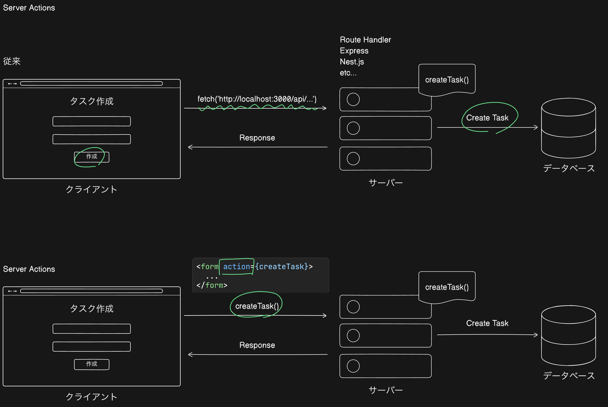
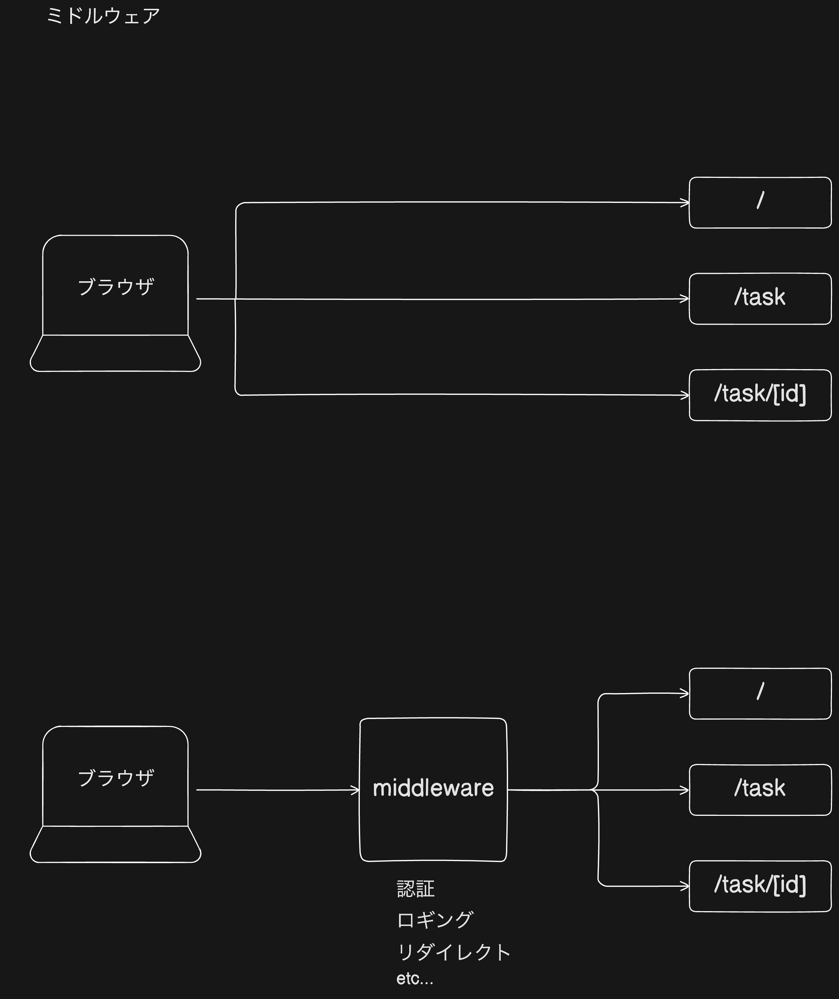

# Next.js 学習用タスクアプリケーション

このプロジェクトは、Next.js 14のApp Routerを使用した学習用のタスク管理アプリケーションです。Next.jsでWebアプリケーションを構築する際に必要な基礎知識（App Router、Server Actions、Middlewareなど）を理解するためのサンプルコードを含んでいます。

## 📋 目次

- [プロジェクト概要](#プロジェクト概要)
- [前提知識](#前提知識)
- [セットアップ手順](#セットアップ手順)
- [Next.jsの主要概念](#nextjsの主要概念)
  - [App Router](#app-router)
  - [基本的なルーティング](#基本的なルーティング)
  - [動的ルーティング](#動的ルーティング)
  - [ルートグループ](#ルートグループ)
  - [レイアウト](#レイアウト)
  - [Server Actions](#server-actions)
  - [Middleware](#middleware)
- [プロジェクト構造](#プロジェクト構造)
- [開発コマンド](#開発コマンド)

## プロジェクト概要

このアプリケーションは、Next.js 14のApp Routerを使用して構築されたタスク管理アプリケーションです。以下の機能を実装しています：

- タスク一覧の表示
- タスクの編集（動的ルーティング）
- Server Actionsによるフォーム送信
- Middlewareによるリクエストインターセプト
- API Routesによるデータ取得

## 前提知識

このプロジェクトを理解するために、以下の知識があると役立ちます：

- Reactの基礎知識（コンポーネント、JSX、Hooks）
- TypeScriptの基礎知識
- HTTPリクエストとレスポンスの概念
- Node.jsの基礎知識

## セットアップ手順

### 1. プロジェクトの作成

Next.jsプロジェクトを新規作成する場合は、以下のコマンドを実行します：

```bash
npx create-next-app@latest nextjs-taskapp --typescript --tailwind --app
```

オプションの説明：
- `--typescript`: TypeScriptを使用
- `--tailwind`: Tailwind CSSを使用
- `--app`: App Routerを使用（Next.js 13以降）

### 2. 依存関係のインストール

既存のプロジェクトの場合、以下のコマンドで依存関係をインストールします：

```bash
npm install
```

### 3. 開発サーバーの起動

```bash
npm run dev
```

ブラウザで [http://localhost:3000](http://localhost:3000) を開いてアプリケーションを確認できます。

### 4. ビルドと本番環境での実行

```bash
# プロダクションビルド
npm run build

# 本番環境で起動
npm start
```

## Next.jsの主要概念

### App Router

Next.js 13以降では、`app`ディレクトリを使用するApp Routerが推奨されています。App Routerは、ファイルシステムベースのルーティングを提供し、以下のような機能をサポートします：

- **Server Components**: デフォルトでサーバーサイドでレンダリングされるコンポーネント
- **Client Components**: `"use client"`ディレクティブを使用してクライアントサイドでレンダリングされるコンポーネント
- **レイアウト**: 複数のページで共有されるUI
- **ローディング状態**: データ取得中のUI表示
- **エラーハンドリング**: エラー発生時のUI表示


### 基本的なルーティング

App Routerでは、`app`ディレクトリ内のファイル構造がそのままURLルートになります。

```
app/
  page.tsx          → /
  about/
    page.tsx        → /about
  contact/
    page.tsx        → /contact
```

各ルートには`page.tsx`ファイルが必要です。このファイルがそのルートのUIを定義します。

**例：`app/(main)/page.tsx`**
```typescript
export default function HomePage() {
  return <div>ホームページ</div>;
}
```

### 動的ルーティング

動的なセグメントを含むルートを作成するには、フォルダ名を角括弧で囲みます：`[folderName]`



**例：`app/task/edit/[id]/page.tsx`**
```typescript
const TaskEditIdPage = ({ params }: { params: { id: string } }) => {
  return <div>Task Edit ID Page: {params.id}</div>;
}

export default TaskEditIdPage;
```

この例では、`/task/edit/1`、`/task/edit/2`などのURLが有効になります。`params`オブジェクトから動的セグメントの値を取得できます。

### ルートグループ

ルートグループは、URLパスに影響を与えずにルートを整理するために使用されます。フォルダ名を括弧で囲むことで作成できます：`(folderName)`



**例：**
```
app/
  (main)/
    page.tsx           → /
    task/
      page.tsx         → /task
  (admin)/
    dashboard/
      page.tsx         → /dashboard
```

ルートグループは、異なるレイアウトを適用したり、ルートを論理的にグループ化する際に便利です。

### レイアウト

レイアウトは、複数のページで共有されるUIです。`layout.tsx`ファイルを作成することで、そのディレクトリとその子ディレクトリのすべてのページに適用されます。



**例：`app/layout.tsx`（ルートレイアウト）**
```typescript
export default function RootLayout({
  children,
}: {
  children: React.ReactNode;
}) {
  return (
    <html lang="ja">
      <body>
        <div>メインレイアウト</div>
        {children}
      </body>
    </html>
  );
}
```

**例：`app/(main)/task/layout.tsx`（ネストされたレイアウト）**
```typescript
export default function TaskLayout({
  children,
}: {
  children: React.ReactNode;
}) {
  return (
    <div>
      <div>Task Layout</div>
      {children}
    </div>
  );
}
```

レイアウトはネストされ、親レイアウトが子レイアウトをラップします。

### Server Actions

Server Actionsは、サーバーサイドで実行される関数です。`"use server"`ディレクティブを使用して定義し、クライアントコンポーネントから直接呼び出すことができます。



**例：`src/actions/sampleActions.ts`**
```typescript
"use server";

export const addTask = async (
  taskId: number,
  state: FormState,
  formData: FormData
): Promise<FormState> => {
  const title = formData.get("title") as string;
  const description = formData.get("description") as string;
  // サーバーサイドでの処理
  return { error: "Error:Task added successfully" };
};
```

**クライアントコンポーネントでの使用：**
```typescript
"use client";

import { addTaskWithId } from "@/actions/sampleActions";
import { useFormState } from "react-dom";

export default function ServerActionsPage() {
  const [state, formAction] = useFormState(addTaskWithId, initialState);
  
  return (
    <form action={formAction}>
      {/* フォームフィールド */}
    </form>
  );
}
```

Server Actionsの利点：
- API Routesを書く必要がない
- 型安全性が高い
- 自動的にサーバーサイドで実行される
- フォーム送信とシームレスに統合できる

### Middleware

Middlewareは、リクエストが完了する前にコードを実行できます。認証、リダイレクト、リクエストの変更などに使用されます。



**例：`src/middleware.ts`**
```typescript
import { NextRequest, NextResponse } from "next/server";

export const middleware = (request: NextRequest) => {
  console.log(`ミドルウェア: ${request.method} ${request.nextUrl.pathname}`);
  return NextResponse.next();
}

// ミドルウェアを適用するルートを指定
export const config = {
  matcher: ['/api/:path*', '/sa/:path*'],
}
```

Middlewareの特徴：
- リクエストとレスポンスをインターセプトできる
- `config.matcher`で特定のパスにのみ適用可能
- 認証チェック、ログ記録、リダイレクトなどに使用

## プロジェクト構造

```
nextjs-taskapp/
├── src/
│   ├── app/                    # App Routerのルート
│   │   ├── (main)/             # ルートグループ（メイン）
│   │   │   ├── page.tsx        # ホームページ (/)
│   │   │   └── task/           # タスク関連ページ
│   │   │       ├── layout.tsx  # タスクレイアウト
│   │   │       ├── page.tsx    # タスク一覧 (/task)
│   │   │       ├── loading.tsx # ローディングUI
│   │   │       └── edit/
│   │   │           ├── page.tsx           # タスク編集 (/task/edit)
│   │   │           └── [id]/
│   │   │               └── page.tsx        # 動的ルート (/task/edit/[id])
│   │   ├── (admin)/            # ルートグループ（管理）
│   │   │   └── dashboard/
│   │   │       ├── layout.tsx  # ダッシュボードレイアウト
│   │   │       ├── page.tsx    # ダッシュボード (/dashboard)
│   │   │       └── error.tsx   # エラーUI
│   │   ├── api/                # API Routes
│   │   │   └── tasks/
│   │   │       └── route.ts    # /api/tasks エンドポイント
│   │   ├── sa/                 # Server Actionsのデモページ
│   │   │   └── page.tsx
│   │   ├── layout.tsx           # ルートレイアウト
│   │   ├── page.tsx           # ルートページ（未使用）
│   │   ├── error.tsx          # グローバルエラーハンドラー
│   │   └── not-found.tsx      # 404ページ
│   ├── actions/               # Server Actions
│   │   └── sampleActions.ts
│   └── middleware.ts          # Middleware
├── public/                    # 静的ファイル
│   └── imgs/                  # 画像ファイル
├── package.json
├── next.config.mjs            # Next.js設定
├── tailwind.config.ts         # Tailwind CSS設定
└── tsconfig.json              # TypeScript設定
```

## 開発コマンド

```bash
# 開発サーバーを起動
npm run dev

# プロダクションビルド
npm run build

# 本番環境で起動
npm start

# ESLintでコードをチェック
npm run lint
```

## 参考リソース

- [Next.js公式ドキュメント](https://nextjs.org/docs)
- [App Router](https://nextjs.org/docs/app)
- [Server Actions](https://nextjs.org/docs/app/building-your-application/data-fetching/server-actions-and-mutations)
- [Middleware](https://nextjs.org/docs/app/building-your-application/routing/middleware)

---

このプロジェクトは学習目的で作成されています。実際のプロダクション環境で使用する場合は、適切なエラーハンドリング、セキュリティ対策、パフォーマンス最適化を実装してください。

